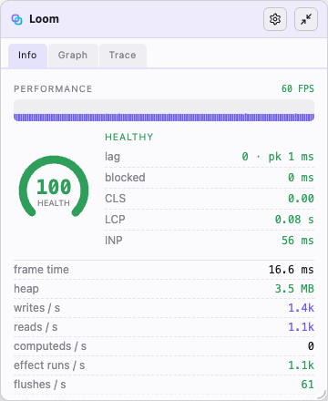
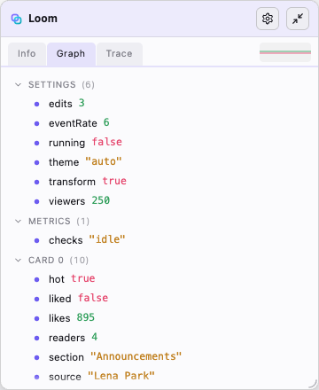
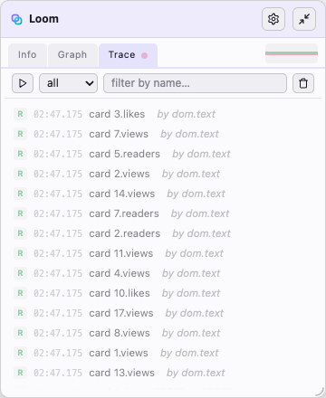

<p align="center">
  
</p>

<h1 align="center">Loom</h1>

<p align="center">
  <strong>A tiny runtime reactive UI core.</strong><br>
  Callable state cells, computed reads, effects, and a small DOM layer —
  no compiler, no virtual DOM.
</p>

<p align="center">
  <a href="./LICENSE"></a>
  
  
  
  
</p>

> Loom is under active development. The API is intentionally small and can still
> change while the core and inspector surface are refined.

## Why Loom

- **Runtime, not compiled.** Plain functions and live DOM nodes — no build-step
  transform and no virtual-DOM diff. JSX returns real elements.
- **Near-native speed.** Built on [`alien-signals`](https://github.com/stackblitz/alien-signals);
  the per-operation read/write/effect path stays within `~1.03x`–`~1.07x` of the
  raw primitives on the chaos benchmark. That thin margin is the always-on channel
  instrumentation; inspection (the heavier per-node metadata) is off by default.
- **Callable cells.** `count()` reads, `count(1)` writes — the whole state model
  in one shape, no setters or hooks.
- **Generic channel/meter primitives.** A gated ring-buffer `channel` and a pull-based
  `meter` for any event or sample stream — zero allocation until metered. Loom uses them
  to instrument itself; that self-watching surface is the opt-in `loom/observe`.
- **Lean core, opt-in surfaces.** `loom` (reactivity, lifecycle, channel/meter) ·
  `loom/observe` (watch loom's internals) · `loom/dom` · `loom/html`
  (SSR/SSG) · `loom/devtools` (dev panel).

## At a glance

```tsx
import { computed, state } from "loom";

const count = state(0);
const label = computed(() => `count: ${count()}`);

function Counter() {
  return <button onclick={() => count(count() + 1)}>{label}</button>;
}

document.body.append(<Counter />);
```

State cells are callable: calling without an argument reads the value, calling
with an argument writes the next one. A `computed` caches a derived read; an
`effect` re-runs when its dependencies change. JSX evaluates once and returns a
real DOM node, with reactive reads wired in place.

## Install

Loom is installed straight from GitHub (it is not published to npm). Use **pnpm**
— Loom builds its `dist` from a `prepare` hook on install, and that hook runs
`pnpm`:

```sh
pnpm add github:jveres/loom
```

Pin to a tag or commit for reproducible builds:

```sh
pnpm add github:jveres/loom#v0.1.0
```

It then imports as `loom` (and `loom/observe`, `loom/dom`, …).

To use browser JSX, point TypeScript (and your bundler) at Loom's automatic
runtime — see [JSX](#jsx). For local development of Loom itself, see
[Develop](#develop).

## Guide

### Core primitives

Import reactive primitives from `loom`.

```ts
import { batch, computed, effect, state, update } from "loom";

const count = state(0);
const doubled = computed(() => count() * 2);

const stop = effect(() => {
  console.log(doubled());
});

batch(() => {
  count(1);
  update(count, (value) => value + 1);
});

stop();
```

The core exports these functions:

- `state(initial, options?)` creates a callable state cell.
- `computed(getter, options?)` creates a cached derived read.
- `effect(fn, options?)` runs `fn` immediately and again when its dependencies
  change. Pass `{ target }` to associate the effect with the DOM node it writes
  (the DOM layer does this for its bindings so the inspector can highlight what a
  cell drives), or `{ defer: true, maxStale? }` to run re-runs off the critical
  path (see [Deferred effects](#deferred-effects)).
- `batch(fn)` groups writes and flushes effects once after the batch.
- `scope(fn, options?)` groups the effects (and `polled`/`source` resources)
  created inside `fn` so they can be disposed (`stop()`) or suspended (`pause()`
  / `resume()`) together. Scopes nest, and an effect runs only while no scope in
  its parent chain is paused. `options` (`internal` / `label`)
  become defaults for every node created in the scope. Returns
  `{ stop, pause, resume }`.
- `untrack(fn)` reads state inside `fn` without subscribing the active effect.
- `trigger(read)` notifies subscribers after in-place mutation.
- `update(source, fn)` writes `fn(source())` back to a state cell.
- `mutate(source, fn)` mutates an object value and then triggers subscribers.

> Writing an immutable value? Call the cell (`count(next)`) or `update` for a
> functional set. Mutating an object/array in place? `mutate` (mutate + notify in
> one) — or `trigger` when the mutation already happened elsewhere and you only
> need to notify.
- `polled(sample, ms, options?)` re-samples `sample()` every `ms` ms into a
  value-deduped reactive source; bindings re-run only when the value changes.
  Bridges imperative/external data (clocks, counters, polled APIs) into the
  graph. Returns a callable read with a `stop`: `p()` reads, `p.stop()` clears
  the timer.
- `source(connect, initial, options?)` creates a **lazy** external source:
  `connect(set)` runs when the source gains its first subscriber and the
  returned teardown runs when it loses its last, so the producer (event
  listener, timer, `PerformanceObserver`, socket) is only live while observed.
  Returns a read function.
- `fields(object, options?)` creates one state cell per enumerable string key.
- `channel(name, options?)` declares a named channel — a **generic**, gated,
  overwriting ring buffer that records cheaply (no allocation until metered) and
  is drained, not pushed. A reusable primitive for any event or sample stream, not
  just telemetry.
- `meter(channels, aggregation?)` attaches a pull-based meter (`aggregation` is
  `"count"`, the default, or `"samples"`); `read()` returns a Frame per channel
  (`{ count, dropped, samples }`) since the last read. A meter is a scope
  resource, so it detaches on `scope.pause()`.
- `configure({ inspect, onError, deferScheduler, deferTimeout })` sets runtime options. `inspect` toggles the
  inspection layer — **off by default**, so node creation allocates no metadata
  (zero cost); turn it on once at startup, before creating the nodes you want
  visible, when you need tooling. `onError` installs a global effect error
  boundary (see [Error handling](#error-handling)); `deferScheduler` /
  `deferTimeout` tune the deferred-effect lane (see [Deferred effects](#deferred-effects)).

> `channel` and `meter` are generic core primitives. **Watching Loom's *own* internals**
> — the `events` registry (the runtime's built-in streams) and the graph-snapshot tools
> `inspect` / `inspectResources` / `depsOf` — is a separate opt-in surface,
> [`loom/observe`](#observability). Keeping it out of the core means the default
> `loom` import stays lean: reactivity, lifecycle, and `channel`/`meter` only.

The core exports these types:

- `State<T>` is a callable read/write cell.
- `Read<T>` is a read function.
- `Stop` is a disposer function.
- `Scope` is a scope handle: `{ stop, pause, resume }`.
- `Polled<T>` is a callable polled source: `Read<T> & { stop }`.
- `SourceConnect<T>` is a lazy source's `(set) => teardown` wiring function.
- `EffectFn` is a reusable effect callback type.
- `ErrorHandler` is the `configure({ onError })` boundary signature.
- `Fields<T>` maps enumerable string keys to `State<T[K]>`.
- `NodeInfo` is the lean node shape (`id` / `kind` / `label`) the
  `configure({ onError })` boundary receives to name the offending node. The full
  `InspectNode`, `InspectSnapshot`, `ResourceCounts` (the `inspect()` /
  `inspectResources()` result shapes), and `NodeKind` (the
  `"state" | "computed" | "effect"` union) come with `loom/observe` — where
  `InspectNode extends NodeInfo`.
- `Channel` is a named channel; `Meter` drains channels;
  `Frame` is a per-channel `{ count, dropped, samples }`; `MeterAggregation` is a
  meter's view (`"count" | "samples"`); `ChannelOptions` configures
  `{ capacity, fields }`.
- `NodeOptions` (`{ internal, label }`) and `EffectOptions` (adds `{ target }`
  and the deferred-lane `{ defer, maxStale }`) are the option bags accepted by the
  primitives; `DeferScheduler` is the configurable deferred-lane scheduler.

Pass `{ label }` to `state`, `computed`, `effect`, or `fields` when
you want meaningful names in tooling. Pass `{ internal: true }` for Loom-owned
tooling state that must not appear in app-level event streams by default.

### Object fields

Use `fields()` when you want fine-grained updates for a plain object. Each
enumerable string key becomes its own state cell.

```ts
const model = fields(
  {
    title: "Hello",
    likes: 0,
  },
  { label: "post" },
);

effect(() => {
  document.title = `${model.title()} (${model.likes()})`;
});

model.likes(1);
```

`fields()` rejects non-plain objects such as arrays and dates. Symbol keys are
not exposed because the runtime uses enumerable string keys. When you pass a
`label`, each field is labeled as `label.key`, for example `post.likes`.

### In-place mutation

Loom state compares values by identity. When you mutate an object or array in
place, use `trigger()` or `mutate()` to notify dependents.

```ts
const rows = state<string[]>([]);

effect(() => {
  console.log(rows().length);
});

rows().push("first");
trigger(rows);

mutate(rows, (value) => {
  value.push("second");
});
```

### External sources

Bridge imperative or external data into the graph. `polled()` re-samples on an
interval (eager, deduped); `source()` is lazy — it connects on first subscriber
and disconnects on last, so the producer only runs while observed.

```ts
import { effect, polled, source } from "loom";

// Eager: sample performance.now() every 250ms (unchanged samples don't re-run readers).
const clock = polled(() => Date.now(), 250);
const stopClock = effect(() => console.log(clock.read()));
// ... later: stopClock(); clock.stop();

// Lazy: a media query that only listens while something reads it.
const darkMode = source<boolean>((set) => {
  const mq = matchMedia("(prefers-color-scheme: dark)");
  const onChange = () => set(mq.matches);
  mq.addEventListener("change", onChange);
  return () => mq.removeEventListener("change", onChange); // runs when unobserved
}, matchMedia("(prefers-color-scheme: dark)").matches);

const stop = effect(() => console.log("dark:", darkMode()));
stop(); // last subscriber gone -> the listener is removed automatically
```

The dev inspector uses both: a `polled()` heartbeat drives its per-tick metric
math, and the CLS/LCP/INP web vitals are `source()`s whose `PerformanceObserver`s
connect and disconnect with the panel — no manual teardown.

### Scopes

`scope(fn)` groups the effects created in `fn` so a whole subtree can be torn
down or suspended at once. `stop()` disposes; `pause()` suspends runs (changes
just mark effects dirty) and `resume()` re-runs the ones that went dirty — so a
hidden panel does no reactive work without losing its state or DOM.

```ts
import { effect, scope, state } from "loom";

const active = state(true);

const panel = scope(() => {
  effect(() => render(active())); // bindings owned by this scope
});

panel.pause(); // hidden: changes to `active` are recorded but don't re-render
panel.resume(); // shown again: re-renders once with the latest value
panel.stop(); // gone for good: every effect in the scope is disposed
```

Scopes nest, and an effect runs only while no scope in its parent chain is
paused. The dev inspector uses this: one scope wraps the whole panel (paused when
minimized) with a nested scope around the stats tab (paused when it isn't the
active tab). Pausing the outer scope freezes everything; resuming it leaves the
stats scope suspended if its tab is still hidden — no manual coordination.

Scopes own resources, not just effects: a `polled()` or `source()` created inside
a scope is suspended with it too. Pausing the scope clears a `polled()`'s timer
(resuming takes a fresh sample) and disconnects a `source()`'s producer even
though its paused subscribers stay linked (resuming reconnects it); stopping the
scope tears them all down. So a hidden subtree stops not only re-rendering but
also the timers and observers feeding it.

A scope's second argument sets default options for everything created inside it —
handy for marking an entire subsystem `internal` (or giving it a shared `label`)
without repeating the options on every primitive. A node's own options win, and
nested scopes inherit and can override:

```ts
import { effect, fields, scope } from "loom";

scope(
  () => {
    const settings = fields({ theme: "dark", zoom: 1 }); // cells inherit the defaults
    effect(() => apply(settings.theme())); // so does this effect
  },
  { internal: true },
);
```

The dev inspector relies on this: its panel scope is created with
`{ internal: true }`, so every binding, the
heartbeat, the web-vital sources and the heap timer are filtered from the
observability it reports — without passing options to each one.

### Deferred effects

Pass `{ defer: true }` to run an effect's **re-runs** off the critical path — idle-first and
coalesced — instead of in the synchronous flush. The first run stays synchronous (deps are tracked,
the initial output is immediate); only re-runs defer. Use it for non-frame-critical reactive work:
telemetry, debounced persistence, secondary UI, or a tool's own rendering.

```ts
effect(() => save(doc()), { defer: true, maxStale: 2000 });
configure({ deferScheduler, deferTimeout }); // override the lane's scheduler / default floor (200ms)
```

- **Coalesced — latest value, not every transition.** Many changes before the next drain collapse
  into **one** run at the latest value; for every-transition, use a `channel`.
- **`maxStale`** (ms) is the guaranteed-refresh floor — idle-first, but at least this often under
  load. It is **best-effort, not hard real-time**: a single app task longer than `maxStale` delays
  everything (the lane bounds Loom's contribution, not the app's long tasks).
- **Scope-aware** — a paused scope doesn't drain its deferred effects; resume re-runs them.
- Deferred effects are **sinks** (render / log / persist), not links in a derivation chain.

The synchronous, glitch-free default is untouched — this is a separate lane, not concurrency in the
core.

### Error handling

By default an effect that throws propagates the error to whatever triggered the
run — a `state` write or `batch` — and aborts the rest of that flush. Install a
global boundary with `configure({ onError })` to contain it: the throw is routed
to your handler and the flush continues running the other effects.

```ts
import { configure, effect, state } from "loom";

configure({
  onError: (error, node) => {
    // `node` is the offending effect's inspect record (when inspection is on),
    // otherwise undefined.
    console.error(`effect ${node?.label ?? "?"} failed:`, error);
  },
});

const count = state(0);
effect(() => {
  if (count() === 1) throw new Error("boom"); // caught by onError, not rethrown
});
const seen = effect(() => (document.title = String(count())));

count(1); // does not throw here; onError fires and `seen` still runs
```

The handler is a single global boundary; pass `configure({ onError: undefined })`
to remove it. Errors raised while *reading* a `computed` still surface at the
reader — `onError` covers effect runs, the push side of the graph.

### DOM and events

Import DOM helpers from `loom/dom`. The DOM layer creates nodes, binds reactive
text, attributes, classes, and styles, reconciles keyed lists, and disposes
owned effects when nodes are removed.

```ts
import { state } from "loom";
import { attr, classed, h, style, text } from "loom/dom";

const hot = state(false);
const label = state("Ready");

document.body.append(
  h(
    "button",
    {
      "aria-pressed": attr("aria-pressed", hot),
      class: classed("hot", hot),
      style: style("opacity", () => (hot() ? 1 : 0.65)),
      onclick: () => hot(!hot()),
    },
    [text(label)],
  ),
);
```

The DOM entrypoint exports these functions:

- `h(tag, props, children)` creates an element.
- `text(read)` creates a text node bound to a reactive read.
- `attr(name, read)` creates an explicit reactive attribute binding.
- `classed(name, read)` creates an explicit reactive class binding.
- `style(name, read)` creates an explicit reactive style binding.
- `list(container, read, options)` reconciles a keyed list into a container.
- `each(items, render, key)` is the inline keyed list — the same reconciliation
  as `list()` but returned as a child expression (see
  [Conditional rendering](#conditional-rendering)).
- `when(cond, render, fallback?)` renders a subtree keyed on the truthiness of
  `cond` (see [Conditional rendering](#conditional-rendering)).
- `match(selector, cases, fallback?)` renders a subtree keyed on `selector()` —
  the switch/case form.
- `dispose(root)` disposes effects owned by a node subtree.
- `remove(node)` disposes a node subtree and removes it from the DOM.
- `tap(node, handler)` binds a robust tap (see below).

These split into two families by where they go. **Child bindings** produce nodes
to place among children — `text`, and the structural `list` / `each` / `when` /
`match`. **Prop bindings** — `attr` / `classed` / `style` — return opaque
descriptors you pass as a prop *value* (`h("a", { class: classed("on", isOn) })`);
the handles are opaque, built only by these factories. (In JSX you rarely need
them: a reactive read as a child, class-map value, or attribute is enough.)

Loom is a thin layer over the DOM, so event props use **the DOM's own lowercase
names** — `onclick`, `oninput`, `onpointerup`, `onkeydown` — not React's
camelCase. Any `on<event>` function prop is wired with `addEventListener`, so you
get standard bubbling and the precise DOM event type in the handler:

```ts
h("input", { oninput: (event) => value(event.currentTarget.valueAsNumber) });
```

(A camelCase `onClick` still works — the runtime lowercases `on*` — but lowercase
is the typed, documented form.)

**`ontap` — the one synthetic event.** iOS Safari **drops the synthesized
`click`** when the DOM mutates between `touchstart` and `touchend`. An app that
rewrites the DOM during interaction (a live dashboard, a game, the demo's chaos
mode) will see taps silently do nothing — the button shows `:active` but the
handler never runs. `ontap` is built from raw `pointerdown`+`pointerup`, which
are dispatched directly rather than hit-test-synthesized, so it survives:

```ts
h("button", { ontap: () => stop() }); // fires reliably even under DOM churn
```

It fires on release when the pointer hasn't moved more than ~10px from the press
(so a drag or scroll doesn't trigger it). Use plain `onclick` everywhere else;
reach for `ontap` only in the rare continuous-mutation case. `tap(node, handler)`
is the same logic for imperative (non-JSX) call sites.

`list()` reorders keyed nodes by default. Pass `reorder: () => false` when an
external layout system positions existing keyed nodes and only needs Loom to
append new keys and remove missing keys.

```ts
list(container, rows, {
  key: (row) => row.id,
  render: (row) => h("article", null, row.title),
  reorder: () => false,
});
```

For long lists, `loom/dom/virtual-list` is a standalone fixed-row-height
virtualizer — only the rows in (and just around) the viewport stay in the DOM.
`virtualList(options)` takes a `VirtualListOptions` (`{ rowHeight, key, render,
overscan? }`) and windows against an existing scroll container, returning a
`VirtualList` handle: `el` (mount it inside the scroller), `setItems(source)`,
`refresh()`, `scrollToIndex(i)`, `scrollToEnd()`, and `destroy()` to tear it down. The inspector's
graph tree is built on it.

Two contracts the virtualizer relies on: **`render(item, reuse)` reuses rows** —
it's called with `reuse = null` to build a row and with the existing element to
update in place, so return the updated `reuse` rather than a fresh node (this is
what keeps DOM churn flat as you scroll). And the elements it returns **must be
absolutely positioned** within `el` (which the module sets to
`position: relative`); it only sets each row's `transform`, so rows without
absolute positioning stack in the wrong place.

### JSX

Loom supports JSX through standard automatic JSX runtime entrypoints. The
browser runtime returns live DOM nodes and uses the same DOM binding helpers as
`h()`. Function components are plain functions; there is no virtual DOM.

Configure TypeScript for browser JSX with `jsxImportSource: "loom"`:

```json
{
  "compilerOptions": {
    "jsx": "react-jsx",
    "jsxImportSource": "loom"
  }
}
```

If your bundler transpiles TSX directly, configure it to use the same automatic
runtime. This repository sets Vite's `oxc.jsx.importSource` to `"loom"`.

Reactive reads can be used directly as children, attribute values, and class
map values.

```tsx
import { state } from "loom";

const count = state(0);

function Counter() {
  return (
    <button
      type="button"
      aria-pressed={() => count() > 0}
      class={{ active: () => count() > 0 }}
      onclick={() => count(count() + 1)}
    >
      {count}
    </button>
  );
}

document.body.append(<Counter />);
```

Class values can be strings, arrays, or object maps. Object map values can be
plain booleans or reactive reads.

```tsx
const running = state(false);

<section
  class={[
    "shell",
    "compact",
    { interactive: true, running, idle: () => !running() },
  ]}
/>;
```

Style values can be strings, arrays, object maps, or explicit `style()`
bindings. Object keys can use camelCase or CSS property names. Reactive style
reads can return `null` to remove the property.

```tsx
import { style } from "loom/dom";

const active = state(false);

<section
  style={[
    "font-size:12px",
    { backgroundColor: "white" },
    { opacity: () => (active() ? 1 : 0.5) },
    style("color", () => (active() ? "red" : null)),
  ]}
/>;
```

Loom is runtime-only: JSX expressions run once when the DOM node is created, so
derived reactive values need a read function or `computed()`.

```tsx
import { computed, state } from "loom";

const running = state(false);
const label = computed(() => (running() ? "Stop chaos" : "Start chaos"));

<button class={{ running }} aria-pressed={running}>
  {label}
</button>;

<button>{() => (running() ? "Stop chaos" : "Start chaos")}</button>;
```

Use these entrypoints for browser JSX:

- `loom/jsx-runtime` powers browser JSX.
- `loom/jsx-dev-runtime` powers browser JSX in development mode.

### Conditional rendering

JSX runs **once** and returns live DOM nodes, so the React habits for branching
do not update. A bare `{open() && <Panel />}` evaluates a single time when the
node is built; wrapping it in a function — `{() => open() && <Panel />}` — does
**not** fix it, because a function child is bound as reactive **text** (it would
stringify the element). What stays reactive in JSX is the leaf bindings: text,
attributes, classes, and styles.

So pick by what you actually need:

**Show / hide** — keep the subtree mounted and toggle visibility with a reactive
class or style binding. Cheapest; state inside the subtree is preserved while
hidden.

```tsx
const open = state(true);

<section style={{ display: () => (open() ? null : "none") }}>
  <Details />
</section>;
```

**Mount / unmount, or swap branches** — use `when()` / `match()` from `loom/dom`.
Each returns a child you drop straight into JSX (or `h()`); it manages an anchored
slot that rebuilds **only when its key changes**, disposing the old subtree's
effects when it swaps.

`when(cond, render, fallback?)` keys on the **truthiness** of `cond`. It builds
`render()` while truthy and the optional `fallback()` while falsy:

```tsx
import { when } from "loom/dom";

const open = state(false);

<aside>{when(open, () => <Panel />, () => <Empty />)}</aside>;
```

Because it only rebuilds when the truthiness **flips**, a `cond` that changes
while staying truthy does *not* recreate the subtree — read live state with your
own bindings inside `render` for that:

```tsx
// `user` changing from one object to another keeps <Profile> mounted; its inner
// bindings update fine-grained. It rebuilds only when user goes null ↔ non-null.
{when(user, () => <Profile name={() => user()?.name} />)}
```

`match(selector, cases, fallback?)` is the switch/case form, keyed on
`selector()`:

```tsx
import { match } from "loom/dom";

const tab = state<"info" | "graph" | "trace">("info");

<main>
  {match(tab, {
    info: () => <Info />,
    graph: () => <Graph />,
    trace: () => <Trace />,
  })}
</main>;
```

For a **keyed list** as a child expression, use `each(items, render, key)` — the
same reconciliation as `list()` (existing rows are moved, not rebuilt; missing
keys are removed and their effects disposed) but inline, without a container
reference:

```tsx
import { state } from "loom";
import { each } from "loom/dom";

const rows = state<readonly Row[]>([]);

<ul>
  {each(
    rows,
    (row) => <li class={{ done: () => row.done }}>{() => row.title}</li>,
    (row) => row.id,
  )}
</ul>;
```

`render(item, key)` must return a single Element; `key(item)` identifies rows
across updates. Reach for `list(container, …)` instead when you already hold the
container element (or need the `reorder` / `animate` options).

Both `each` and `list` render a row **once per key** — like the conditional
helpers, they reconcile structure, not row contents. A row whose key is unchanged
is reused as-is; its `render` does not re-run when the item behind that key is
replaced. So make the row read live state through its own bindings (`{() =>
row.title}`, `class={{ done: () => row.done }}`), or, if a row is a static
snapshot, fold the fields it shows into the `key` so a changed field produces a
new key and rebuilds the row.

`when`, `match`, and `each` must each be placed as a child of a Loom element
(that is what wires the slot); they are not standalone mount points.

### SSR and SSG

Use `loom/html` when you want static HTML for server-side rendering or
static-site generation. This runtime escapes interpolated text, supports
components and fragments, serializes common attributes, and omits event
handlers because there is no live DOM.

```tsx
/** @jsxImportSource loom/html */
import { renderToString } from "loom/html";

function Page(props: { title: string }) {
  return (
    <main>
      <h1>{props.title}</h1>
      <p>Generated with Loom.</p>
    </main>
  );
}

const html = renderToString(<Page title="Docs" />);
```

The `loom/html` entrypoint exports:

- `renderToString(child)` serializes a node tree to an HTML string.
- `html(strings, ...values)` is a tagged template that escapes interpolated
  values and returns an `Html` node.
- `unsafeHtml(value)` marks a pre-trusted string as `Html` so it is emitted
  verbatim, bypassing escaping — **trusted input only**: never pass user-supplied
  content (everything interpolated into `html` is escaped; this is the one hole).
- `isHtml(value)` is the type guard for an `Html` node.
- `escapeText(value)` / `escapeAttribute(value)` are the underlying escapers, for
  hand-built markup.
- `Html` and `HtmlChild` are the node types.

Use these entrypoints for static HTML JSX:

- `loom/html/jsx-runtime` powers static HTML JSX.
- `loom/html/jsx-dev-runtime` powers static HTML JSX in development mode.

### Observability

**`channel` and `meter` are generic core primitives.** A channel is a gated,
overwriting ring buffer that a consumer **drains on its own clock**: it records
nothing (and allocates nothing) until a meter attaches, and under load keeps only
its most recent samples, so it stays bounded and the producer runs at full speed
regardless of how fast the consumer reads. Use them for any event or sample stream.

The runtime emits to a built-in set of these streams — the **`events` registry**,
exposed from `loom/observe` (loom watching its own pipeline, so it lives in
the observability surface, not the core). A meter reads its channels through one of
two **views**: `"count"` (the default — exact counts for rates, with zero per-event
allocation) or `"samples"` (the channel's retained ring records, for event streams
and value histograms):

```ts
import { channel, meter } from "loom"; // generic primitives
import { events } from "loom/observe"; // loom's own built-in streams

// Rates — the "count" view (default), allocation-free:
const rates = meter([events.write, events.effect]);
// Records — the "samples" view: e.g. each flush's batch size + duration:
const flushes = meter([events.flush], "samples");
setInterval(() => {
  console.log("writes/s≈", rates.read()["loom:write"].count * 4);
  const last = flushes.read()["loom:flush"].samples.at(-1);
  if (last) console.log("last flush", last.batchSize, last.durationMs);
}, 250);

// Your own channel — count-only, or a bounded detail ring read via the "samples" view:
const paint = channel("app:paint", { capacity: 256, fields: ["ms"] });
paint.emit(16.7); // no-op and zero-alloc unless someone is metering it
```

The built-in `events` record **non-internal** nodes only, so the idle baseline is
zero. The rest of `loom/observe` snapshots the reactive graph:

- `inspect()` returns a snapshot of the current graph (empty unless inspection is
  enabled via `configure({ inspect: true })`). Pass `{ active: true }` to skip
  state/computed cells with no subscribers — idle cells and "ghosts" (cells of a
  removed object, unreachable but not yet GC'd); effects are always kept.
- `inspectResources()` returns a live census `{ states, computeds, effects, views,
  sources, scopes, channels, unread }` — one cheap walk, no per-node allocation.
  `views` are the DOM bindings (effects bound to a DOM node via `target`); `unread` is the
  count of states/computeds nothing currently reads (a rising count hints at a leak).
- `depsOf(read | stop)` returns a node's inspected dependencies.

### Inspector

`loom/devtools` is a self-contained dev panel built entirely on the public
surface (`inspect`, `inspectResources`, `meter`/`events`, `scope`,
`polled`, `source`). Mount it to get a live, draggable, resizable overlay; it is
purely a consumer of the runtime, so the same data is available to any tooling
you write yourself.

The panel has three tabs:

<p align="center">
  <picture>
    <source media="(prefers-color-scheme: dark)" srcset="./assets/inspector-info-dark.png">
    
  </picture>
  <picture>
    <source media="(prefers-color-scheme: dark)" srcset="./assets/inspector-graph-dark.png">
    
  </picture>
  <picture>
    <source media="(prefers-color-scheme: dark)" srcset="./assets/inspector-trace-dark.png">
    
  </picture>
</p>

<p align="center">
  <em><strong>Info</strong> — FPS, web-vitals and live pipeline rates · <strong>Graph</strong> — state cells grouped by source with current values · <strong>Trace</strong> — the live event stream, pausable and filterable.</em>
</p>

```ts
import { mountInspector } from "loom/devtools";

mountInspector(); // appends to document.body by default; pass an Element to host it elsewhere
```

The entrypoint exports four functions:

- `mountInspector(target?)` builds and shows the panel (no-op if already
  mounted, or outside a DOM).
- `unmountInspector()` tears it down and releases its meters, heartbeat and
  observers.
- `inspectorMounted()` reports whether it is currently shown.
- `toggleInspector(target?)` mounts if hidden, unmounts if shown — handy on a
  hotkey.

**Mounting turns inspection on.** `mountInspector()` calls
`configure({ inspect: true })` for you, but only nodes created *after* that point
carry metadata. To see pre-existing nodes in the census and graph, enable
inspection at startup before creating them:

```ts
import { configure } from "loom";
import { mountInspector } from "loom/devtools";

configure({ inspect: true }); // earliest opportunity — every node from here is visible
// ... build your app ...
mountInspector(); // or wire it to a hotkey via toggleInspector()
```

The panel has three tabs:

- **Info** — the `inspectResources()` census (states, computeds, effects, views,
  sources, scopes, channels, `unread`) plus a live rendering-pipeline sparkline
  (writes in vs DOM updates out) driven by a `meter` over the built-in `events`.
- **Graph** — the reactive graph as a virtualized tree of state/computed cells,
  grouped by `fields()` group. A filled dot means the cell drives a
  DOM node downstream; a hollow dot means it doesn't. Hovering a cell (or a group
  header) highlights every DOM target it feeds; the locate button scrolls the
  first target into view. Primitive state cells are editable in place, and values
  flash on change.
- **Trace** — a live, newest-on-top causal trace of reactive events, read from the
  `loom:read` and `loom:write` channels' `samples` views. Each row shows the cell, the
  change (`prev → next` for writes), and the **source** — the effect/computed that read
  or wrote it (`by dom.class.chaos`), so the stream reads as "who did what". A header
  selector picks reads / writes / all; pause, clear, and a name filter narrow it; the
  last window (1k–25k, set from the menu) is kept, with filtered matches accumulating
  their own window. Hover a row to highlight the DOM node(s) the cell drives; click a
  name to jump to it in the Graph.

The panel is styled by a single `inspector.css` — ordinary formatted CSS, authored
with native nesting and scoped under `#loom-inspector` (and `#loom-inspector-menu`
for the portalled menu). It is imported as a string via Vite's `?inline` and
injected once at runtime as a `<style>`, so the panel ships fully styled with no
CSS-in-JS and nothing for consumers to set up. The id scoping is deliberate — it
keeps the panel styled correctly inside arbitrary host pages (light-DOM isolation by
specificity, not Shadow DOM); theme colours are `--li-*` custom properties switched
by a `data-theme` attribute (`light` / `dark` / `system`).

## Performance

The CLI benchmark compares Loom against native `alien-signals` primitives under a
full-chaos workload (`vitest bench`). It runs three variants on the same machine:
`loom` (using `fields()`), `loom manual` (manually declared state cells), and
`alien native` (native `alien-signals` cells).

```sh
npm run bench
```

With inspection off (the default), Loom runs within `~1.03x` (manual cells) to
`~1.07x` (`fields()`) of native `alien-signals`. The per-operation
read/write/effect hot paths carry only branch-predicted channel guards and
otherwise match the native primitives — see [Design notes](#design-notes) for the
attribution. Enabling inspection (`configure({ inspect: true })`) adds one
metadata object plus a `WeakRef` per node created, which widens the gap to
~`1.2x` on create-heavy work.

A browser benchmark is also available from the dev server at `/bench/`. It uses a
js-framework-benchmark style table workload and compares Loom DOM bindings
against a hand-written vanilla DOM baseline.

## Design notes

Loom uses `alien-signals` as the reactive graph implementation detail. The
public API stays small: callable state cells, computed reads, effects, batching,
manual triggers, object field cells, and an observability surface.

The built-in event channels are gated by a per-channel meter count, so
reads, writes, computed updates, and effect runs stay allocation-free and pay
only a predicted-not-taken branch when nothing is metering them; records are
written into a pre-allocated ring. Inspection is opt-in
(`configure({ inspect: true })`): while it is off, nodes carry no metadata at
all; while it is on, each node carries a lightweight metadata record so
`inspect()` and `depsOf()` work without any further setup.

### Hot path

The per-operation read/write/effect path is deliberately kept at parity with the
underlying `alien-signals` primitives. The callable cell shape (`signal(...value)`
read/write dispatch) is the same one `alien-signals` uses, so Loom adds no
allocation of its own there.

The whole measured gap over native `alien-signals` is the channel
instrumentation — the `someCh.meters !== 0 && …` guard inlined at each
read/write/compute/effect/create/dispose site. A controlled experiment (stripping
just the state-path guards and re-running the chaos bench) attributes ~3% to it on
the manual-cells path: the cost of keeping observability always available with
zero allocation when idle. With the guards in place Loom lands within `~1.03x`
–`~1.07x` of native, and that margin *is* the channel layer, not overhead to
optimize away.

Two things are intentionally left as-is: the read/write rest parameter (shared
with `alien-signals`, so removing it would diverge from the reference for no real
win) and `kindOf`'s `in`-operator dispatch (off the measured hot path — it runs in
the dirty-check callbacks, which a state→effect graph barely exercises). Inspection
metadata is the one cost that *was* per-node allocation, which is why it is opt-in
and off by default.

## Develop

Loom is developed from source with `pnpm`:

```sh
pnpm install
pnpm run check   # tsc --noEmit
pnpm run lint    # biome
pnpm test        # vitest
pnpm run bench   # CLI benchmarks (chaos, micro, hot-path)
pnpm run dev     # dev server
pnpm run build   # dist/loom (ES bundles) + dist/types (.d.ts)
```

`pnpm run build` compiles the publishable `dist` that the `exports` map points
at; `github:jveres/loom` runs it automatically on install via `prepare`. While
developing Loom itself, its own `loom` / `loom/*` imports resolve to `src`
instead (a shared alias in `loom.aliases.ts`, plus `tsconfig` `paths`), so
`check` / `test` / `dev` never need a build.

With the dev server running, open `/demo/` for the realtime UI demo or `/bench/`
for the browser benchmark. The demo is a realtime stress UI written in Loom JSX:
it exercises state cells, object fields, computed values, effects, keyed list
reconciliation, direct JSX text/attribute/class bindings, cleanup through DOM
disposal, and the browser JSX runtime.

The browser benchmark (`/bench/`) is a [js-framework-benchmark](https://github.com/krausest/js-framework-benchmark)-style
keyed-table suite that times Loom against a hand-written vanilla-DOM baseline on
the same operations — create 1k/10k rows, append 1k, update every 10th, swap,
select, remove, and clear. **Run** reports each operation's median time and the
Loom/vanilla ratio (plus a geo-mean) against indicative published slowdowns for
other frameworks; **Profile** re-runs Loom in a split mode that separates
synchronous reconciliation work from forced browser layout, so you can see which
of the two dominates a given operation. Compare ratios, not absolute milliseconds —
they are machine-specific. This is the in-browser counterpart to the CLI
`pnpm run bench` (the `bench/*.bench.ts` chaos, micro, and hot-path suites).

## License

[MIT](./LICENSE) © Janos Veres
